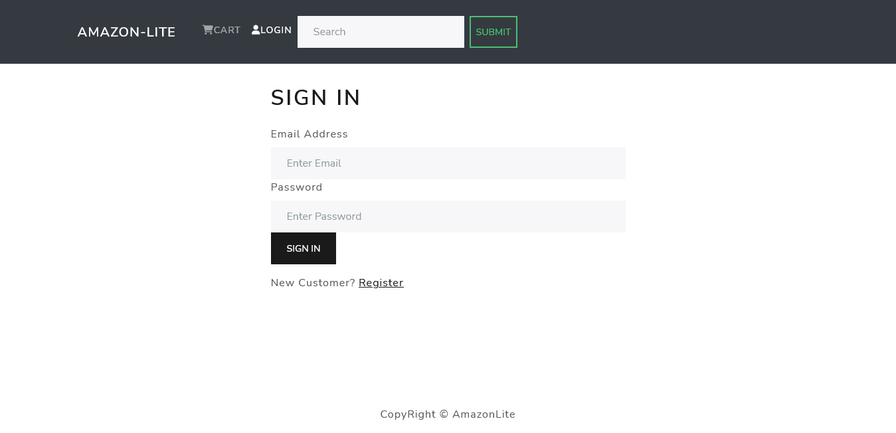
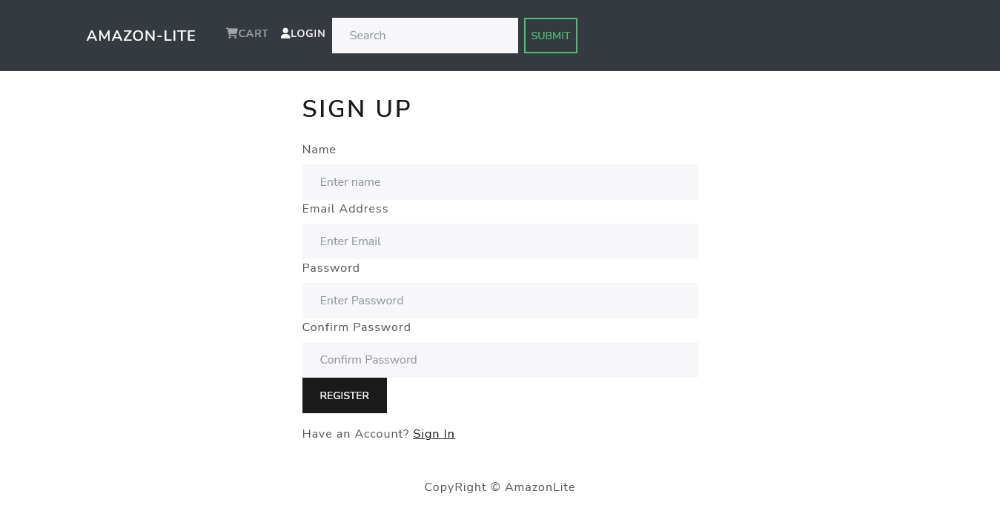
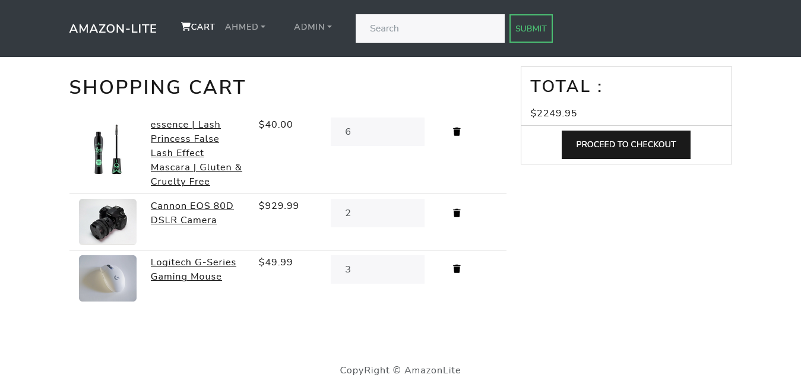
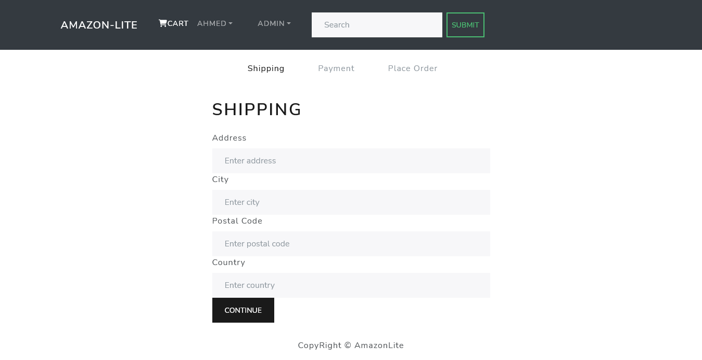
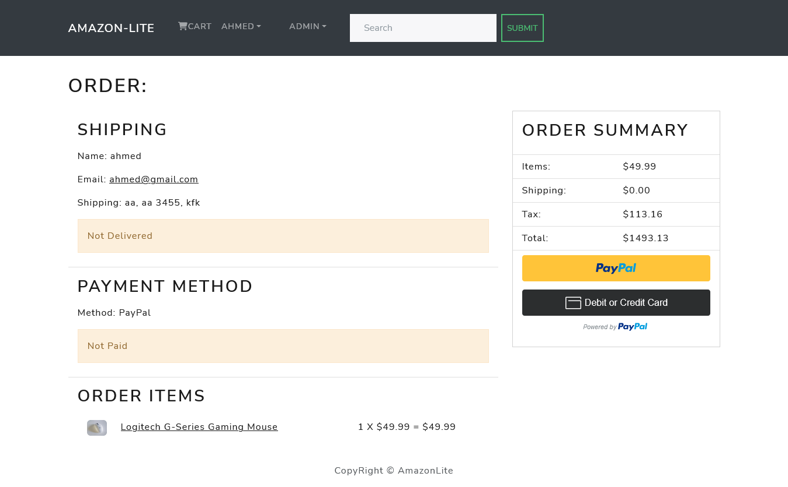
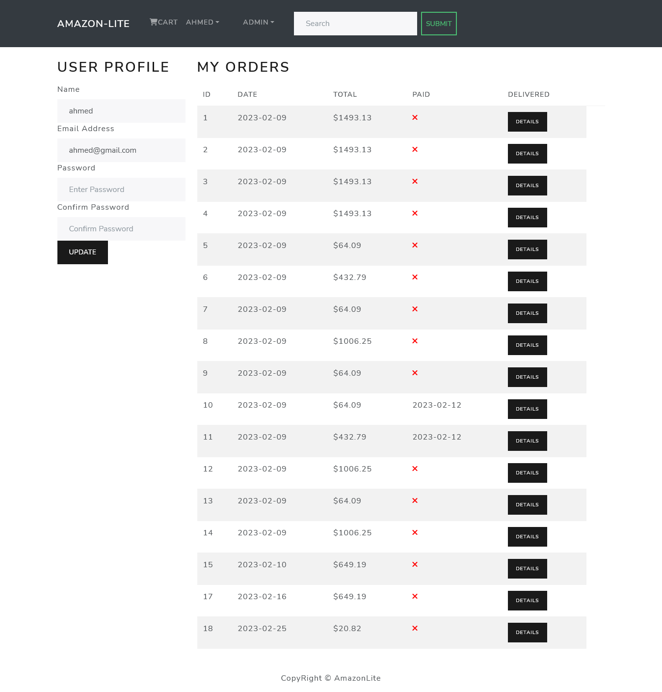
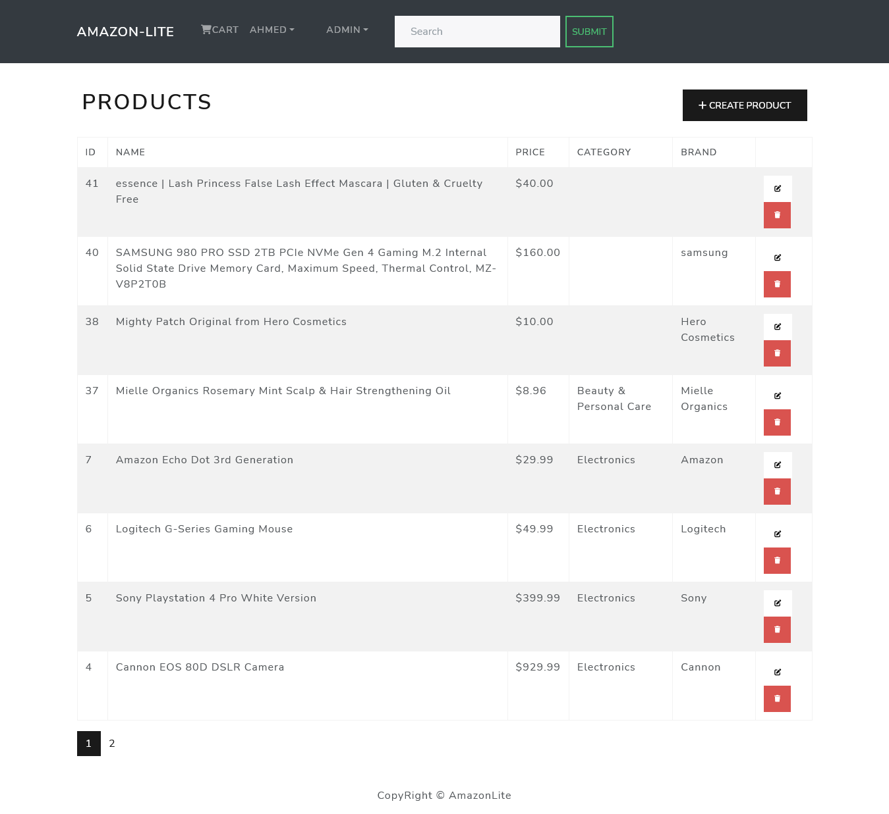
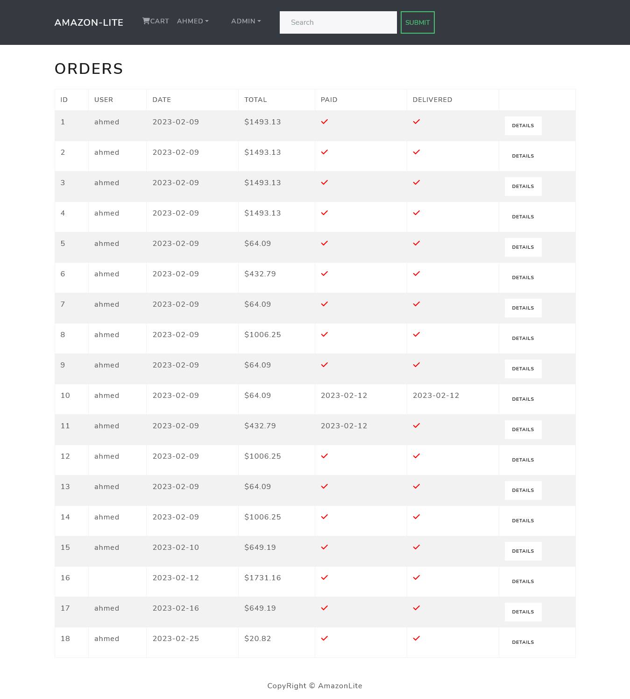
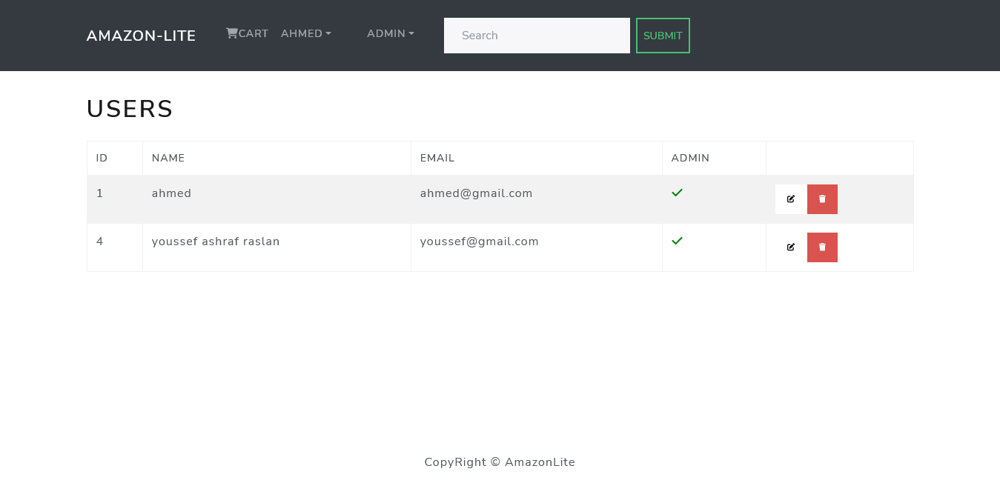

# FullStack_Ecommerce_App

A FullStack Ecommerce App built using Django and React.

# Table of content

- [About_this_App](#About_this_App)
- [Project_Features](#Project_Features)
- [App_Overview](#App_Overview)
  - [Login_Register](#Login_Register)
  - [Home_Page](#Home_Page)
  - [Single_Product_Page](#Single_Product_Page)
  - [Shopping_Cart](#Shopping_Cart)
  - [Shipping_address](#Shipping_address)
  - [OrderDetail_Payment](#OrderDetail_Payment)
  - [UserProfile_Orders](#UserProfile_Orders)
  - [Admin_Panel](#Admin_Panel)
- [Installation](#Installation)
- [Testers](#Testers)

## About_this_App

One of the key features of this E-commerce platform is its integration with PayPal payment gateway. This means that customers can securely and easily make payments for their orders using their PayPal account. The platform provides a seamless checkout process, allowing customers to complete their orders quickly and efficiently.

The application has a user-friendly interface that is easy to navigate, with features such as search functionality. Customers can browse through products, add them to their cart, and then proceed to checkout. The application also allows customers to create an account, which enables them to view their order history, manage their shipping and billing addresses, and save their payment methods.

For business owners, the E-commerce platform provides a powerful admin panel that allows them to manage their products, orders, customers. They can add new products, update existing ones, and manage their inventory levels.

## Project_Features

A completely customized eCommerce / shopping cart application using Django, REACT and REDUX with the following functionality:

- Full featured shopping cart
- Product reviews and Ratings
- Top products carousel
- Product pagination
- Product search feature
- User profile with orders
- Admin product management
- Admin user management
- Admin Order details page
- Mark orders as a delivered option
- Checkout process (shipping, payment method, etc)
- PayPal / credit card integration

## App_Overview

### Login_Register

Login with your account or create new one if not registered.

---

### Home_Page

displays all the available products on the website with paginate & top 5 highest rating produts .

---

### Single_Product_Page

display all information about single product, with ability to add review.

---

### Shopping_Cart

display all the products added to the cart  

---

### Shipping_address

the order shipping address.

---

### OrderDetail_Payment

show the order details and payment

---

### UserProfile_Orders

show the user profile with ability to update user info & show all the user orders

---

### Admin_Panel

full functionality admin panel with abiliy to full control of users and orders and products

## Installation

after downloading/cloning the repository code follow below steps:

- (NOTE: you will need to download poetry for virtual enviroment, https://python-poetry.org/docs)

### Backend

1. Move in backend folder through terminal and run following commands,

`poetry install`

`poetry shell`

`python manage.py runsever`

### Frontend

2. Move in frontend folder through terminal and run follwing commands,

`npm i --force`

`npm start`

## Testers

| Email             | Password    | Type                                    |
| ----------------- | ----------- | --------------------------------------- |
| user@gmail.com    | user        | user                                    |
| admin@gmail.com   | admin       | admin                                   |
| payment@mailna.co | payment1234 | Fake paypal sandbox account for testing |
