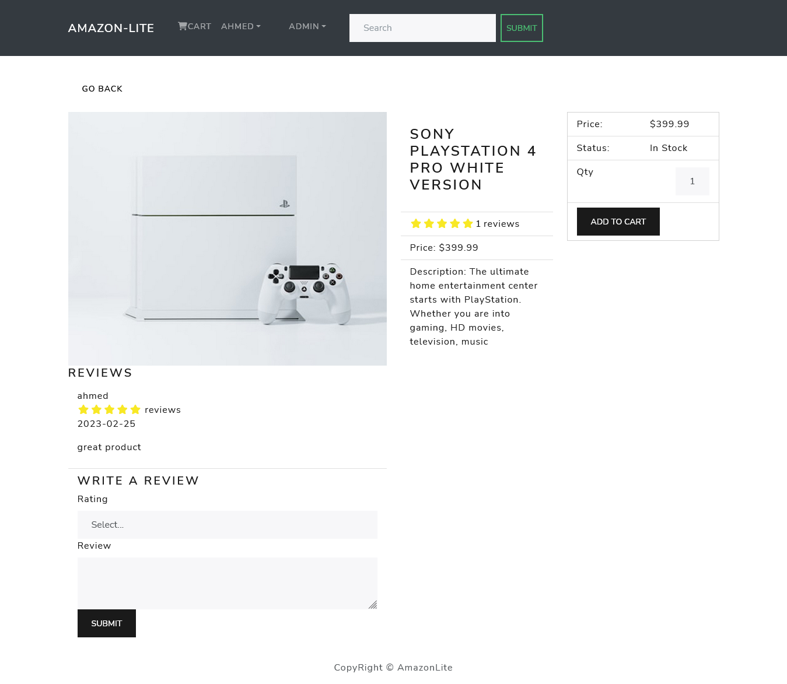

# FullStack_Ecommerce_App
A FullStack Ecommerce App built using Django and React.

# Table of content 
- [About_this_App](#About_this_App)
- [App_Overview](#App_Overview)
  * [Home Page](#Home Page)
  * [Single Product Page](#Single Product Page)

## About_this_App
One of the key features of this E-commerce platform is its integration with PayPal payment gateway. This means that customers can securely and easily make payments for their orders using their PayPal account. The platform provides a seamless checkout process, allowing customers to complete their orders quickly and efficiently.

The application has a user-friendly interface that is easy to navigate, with features such as search functionality. Customers can browse through products, add them to their cart, and then proceed to checkout. The application also allows customers to create an account, which enables them to view their order history, manage their shipping and billing addresses, and save their payment methods.

For business owners, the E-commerce platform provides a powerful admin panel that allows them to manage their products, orders, customers. They can add new products, update existing ones, and manage their inventory levels.

## App_Overview
### Home Page
displays all the available products on the website with paginate & top 5 highest rating produts .

### Single Product Page
display all information about single product.

